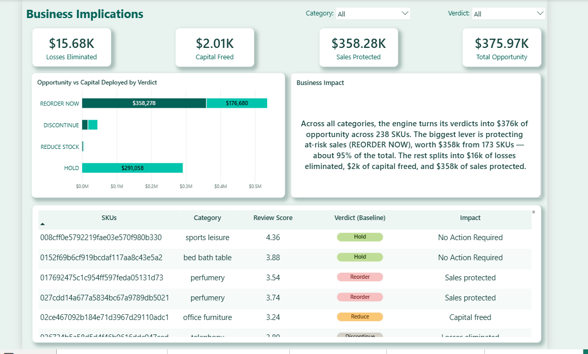
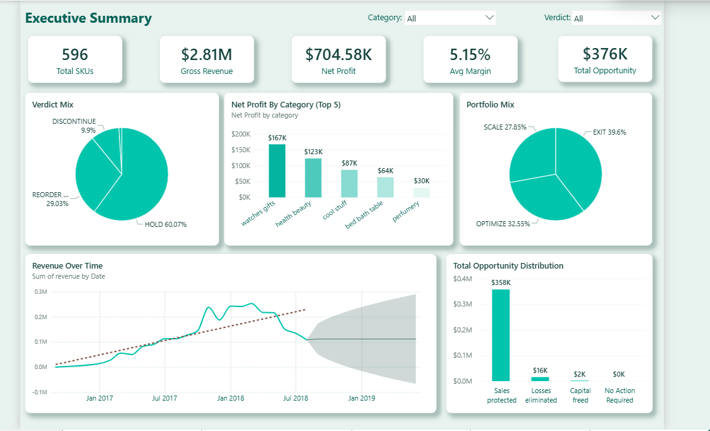
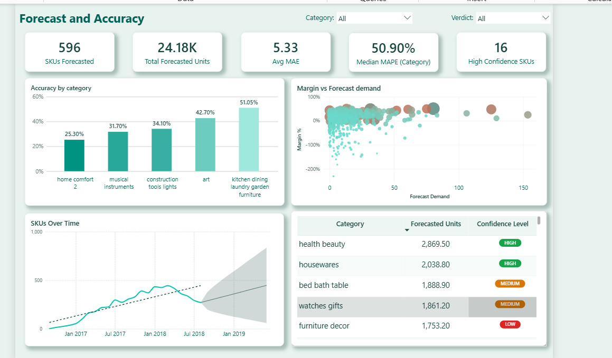
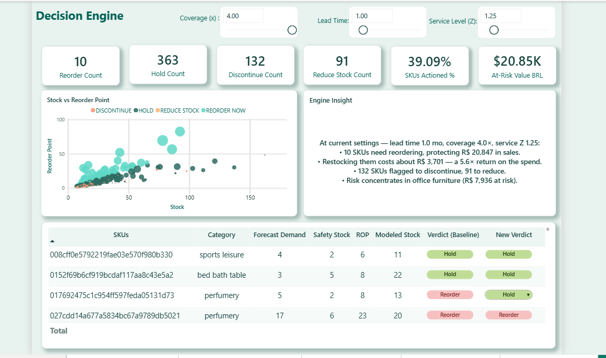
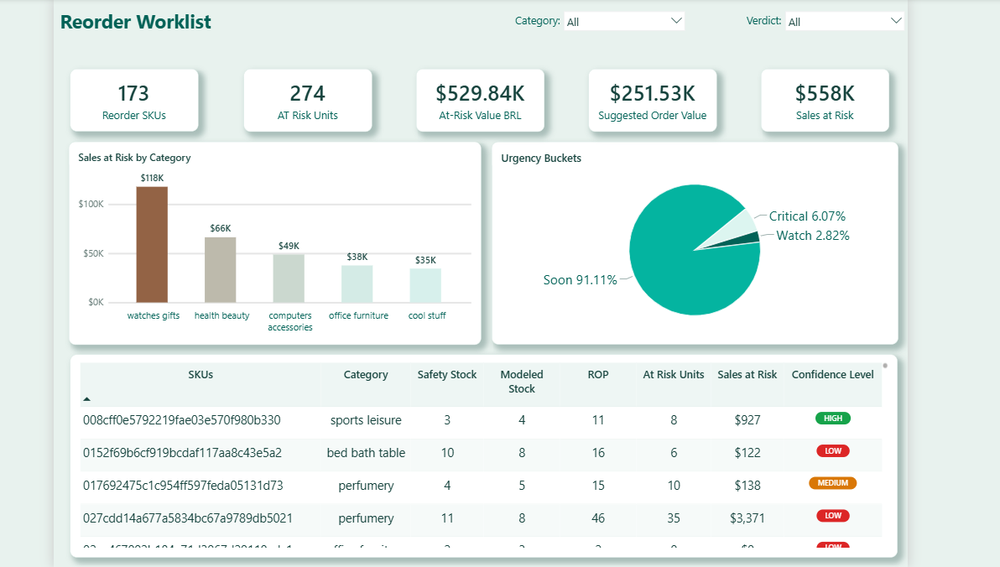
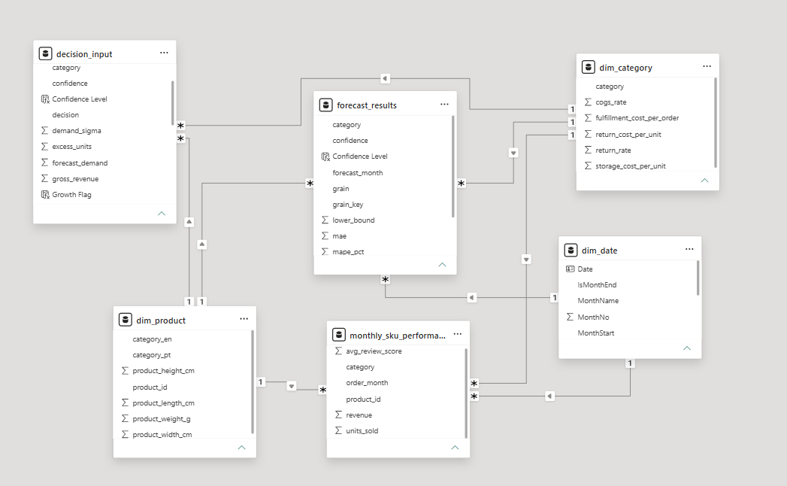

# Decision Intelligence System for Inventory & Profit Optimization in E-commerce SMEs (Olist Dataset)

---

## Executive Summary

This project presents an end-to-end Decision Intelligence System designed to improve inventory management efficiency and profitability for e-commerce Small and Medium-sized Enterprises (SMEs) using the Olist dataset.

The system goes beyond traditional business intelligence dashboards by integrating data engineering, forecasting, and rule-based decision logic into a unified analytical framework that supports operational decision-making.

Instead of only describing historical performance, this system generates actionable business decisions such as:
- What products should be reordered
- Which SKUs should be reduced or discontinued
- Where inventory risk and stockout exposure exist
- How to optimize working capital allocation

This project demonstrates a scalable analytical framework that can be applied across retail, e-commerce, and logistics industries to improve supply chain efficiency and data-driven decision-making.

## Repository Note

Due to GitHub file size limitations, this repository includes representative sample data and SQL import scripts instead of the complete dataset. The sample preserves the original database schema, table relationships, data structure, referential integrity, and SQL workflow used in the full project. All data preprocessing, forecasting, analytical models, business logic, financial analyses, and Power BI dashboards were developed using the complete project dataset. The sample files are provided solely to demonstrate the project's architecture, implementation, and analytical methodology in a GitHub-friendly format.

---

## Business Problem

E-commerce SMEs frequently face challenges in inventory and demand planning due to:

- Lack of accurate demand forecasting capabilities
- Overstocking of low-performing products
- Stockouts of high-demand SKUs leading to lost revenue
- Limited visibility into SKU-level profitability
- Reactive decision-making instead of proactive planning

These inefficiencies result in:
- Revenue loss due to stockouts
- Excess inventory holding costs
- Inefficient capital utilization
- Suboptimal product portfolio performance

This project addresses these challenges by developing a structured Decision Intelligence System that transforms raw transactional data into actionable inventory decisions.

---

## Solution Overview

The system is built as a multi-layer analytical architecture:

### 1. Data Layer
- Olist e-commerce dataset (orders, products, customers, reviews)
- Structured into relational and analytical models
- Data stored and managed in PostgreSQL

### 2. Data Processing Layer (Python)
Python is used for:
- Data cleaning and preprocessing
- Feature engineering for SKU-level analysis
- Aggregation of transactional data into time-series structures
- Preparation of datasets for forecasting and decision modeling

### 3. Data Engineering Layer (SQL)
SQL is used to:
- Build fact and dimension tables
- Create analytical views for reporting
- Structure data into a scalable star schema model

### 4. Forecasting Layer
- SKU-level demand analysis and forecasting support
- Time-series pattern identification
- Model evaluation using MAE and MAPE
- Forecast confidence scoring for decision reliability

### 5. Decision Engine Layer
A rule-based decision system classifies each SKU into:

- Reorder Now
- Hold
- Reduce Stock
- Discontinue

Based on:
- Forecasted demand
- Safety stock levels
- Reorder point calculations
- Profitability thresholds
- Demand variability and risk exposure

### 6. Business Intelligence Layer (Power BI)
Interactive dashboards provide:
- Executive KPI monitoring
- SKU-level profitability analysis
- Inventory optimization insights
- Financial impact measurement
- Scenario-based decision simulation

---

## Data Model

The system follows a structured star schema design:

### Fact Tables:
- monthly_sku_performance
- forecast_results
- decision_input

### Dimension Tables:
- dim_product
- dim_category
- dim_date

This structure enables scalable analysis across time, product categories, and business dimensions.

---

## Key Features

- End-to-end Decision Intelligence framework
- SKU-level demand forecasting system
- Inventory optimization using safety stock and reorder point logic
- Automated decision engine for inventory actions
- Financial impact quantification (sales at risk, capital optimization)
- Scenario-based what-if analysis for inventory planning
- Scalable architecture applicable to SME operations

---

## Business Impact

The system generates measurable business insights, including:

- $358K+ in estimated sales protected through proactive inventory planning
- $375K+ total identified optimization opportunity
- 596 SKUs analyzed at granular level
- Inventory risk classification across product portfolio
- Reduction of stockout risk through predictive replenishment logic

This demonstrates how data-driven decision systems can significantly improve operational efficiency and financial performance in SME environments.

---

## Technical Stack

- Python (data preprocessing, feature engineering, analytical modeling)
- SQL (data transformation and data modeling)
- PostgreSQL (database management)
- Power BI (interactive dashboards and visualization)
- DAX (business logic and KPI calculations)
- Time-series analysis techniques
- Dimensional data modeling (star schema architecture)

---

## Decision Logic

Inventory decisions are based on structured business rules:

- Discontinue:
  SKUs with low forecast demand and low profitability

- Reorder:
  When current stock falls below calculated reorder point

- Reduce Stock:
  When inventory exceeds optimized threshold levels

- Hold:
  Stable SKUs within optimal inventory range

---

## System Architecture Flow

Python → SQL (PostgreSQL) → Data Modeling → Forecasting → Decision Engine → Power BI Dashboards → Business Insights

---

## 📊 Power BI Dashboards (Decision Intelligence System)

This section presents interactive dashboards built in Power BI to support inventory optimization, demand forecasting, and profitability decision-making for e-commerce SMEs.

---

### 📌 Business Impact
Business value generated from the Decision Intelligence System, including inventory optimization insights and profitability improvements.

---

### 📌 Executive Summary
High-level overview of system performance, SKU-level insights, and operational KPIs.

---

### 📌 Forecasting & Accuracy
Demand forecasting insights and trend analysis used to support inventory planning decisions.

---

### 📌 Decision Engine
Rule-based decision system classifying SKUs into actions such as Reorder, Hold, Reduce, and Discontinue.

---

### 📌 Reorder Worklist
Actionable inventory recommendations generated from forecasting and decision rules.

---

### 📌 Data Model
Underlying data architecture (star schema) supporting analytics and Power BI reporting layer.

---

## How to Run This Project

This project follows an end-to-end analytical workflow combining Python, SQL, and Power BI.

### 1. Clone Repository
Clone the repository to your local system.

### 2. Database Setup (PostgreSQL)
- Create a PostgreSQL database
- Load Olist dataset into the database
- Execute SQL scripts to build fact and dimension tables

### 3. Data Processing (Python)
- Run Python scripts for data cleaning and feature engineering
- Generate SKU-level aggregated datasets
- Prepare forecasting-ready time-series structures

### 4. Power BI Dashboard
- Open the Power BI (.pbix) file
- Connect to PostgreSQL database
- Refresh data sources

### 5. Explore Decision Intelligence System
Analyze:
- Demand forecasts
- SKU profitability
- Inventory optimization decisions
- Reorder recommendations
- Financial impact insights

---

## Key Learnings

- Designing end-to-end decision intelligence systems for business operations
- Translating raw transactional data into actionable business decisions
- Building forecasting and inventory optimization frameworks
- Developing scalable data architectures using Python, SQL, and Power BI
- Connecting analytics directly to financial and operational outcomes

---

## System Extension Opportunities

This Decision Intelligence System is fully functional and designed for scalability. It can be extended into production-level environments through:

- Integration of advanced ML forecasting models (e.g., XGBoost, Prophet, LSTM)
- Real-time inventory tracking systems for dynamic decision-making
- Supplier lead time variability modeling for improved procurement planning
- Profit optimization engines integrating pricing and demand elasticity
- API-based deployment for ERP and e-commerce system integration

  ---

## About the Author

**Anara Bekbolot**  
**Business Intelligence Analyst | Self-Employed (Axiom Distribution LLC)**

**SQL | PostgreSQL | Python | Excel | Power BI | Business Intelligence | Decision Intelligence | E-commerce Analytics**

Focused on helping small and medium-sized businesses transform data into actionable insights through business intelligence, profitability analysis, inventory optimization, and data-driven decision-making.

---
